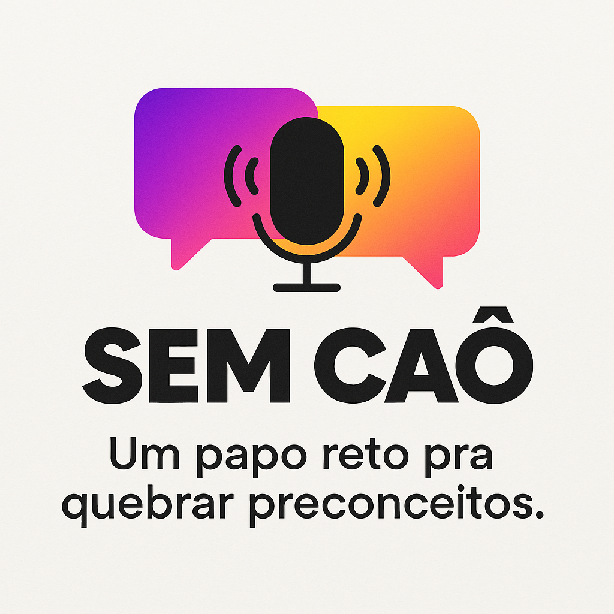

<p align="center">
  
</p>

<p align="center">
  <a href="#">
    
  </a>
  <a href="#">
    
  </a>
</p>

<p align="center">
  🎧 Preview do podcast: https://youtu.be/YCHOLWmXdRE
</p>

<div align="center">
  <audio src="output/semcao.mp3" controls title="Sem Caô - Trailer"></audio>
</div>

---

# 🎙️ Sem Caô — Podcast

> **Um papo reto pra quebrar preconceitos.**

## 🎯 Propósito & Conceito
O **Sem Caô** promove conversas francas e acessíveis sobre **diversidade sexual** e **quebra de preconceitos**, voltado para um público **hétero e bissexual** que quer entender melhor o universo **LGBTQIA+**.  
O tom é **direto, leve e sem tabu**, com **humor inteligente** e linguagem próxima do público **jovem de classe C**. A ideia é **desmistificar estigmas** e criar um **espaço seguro** para diálogo, **sem julgamentos**.

## 🧭 Identidade & Tom
- **Estilo:** jovem, urbano, acolhedor e provocativo  
- **Personalidade:** autêntico, sem frescura, com pegada **POP** e linguagem popular  
- **Mensagem‑chave:** **Mais diálogo, menos preconceito.**  
- **Slogan:** **Um papo reto pra quebrar preconceitos.**

## 🖌️ Como criei o logo
O logo foi desenvolvido com **IA** seguindo a identidade visual do projeto.

### ✅ Etapas do processo
1. **Definição do conceito**  
   - Nome: **Sem Caô**  
   - Propósito: Conversas francas sobre diversidade sexual, quebrando preconceitos.  
   - Estilo: Jovem, urbano, POP, com cores vibrantes e tipografia bold.  

2. **Geração do design**  
   - Ferramenta: **Microsoft Copilot** (IA para design e SVG).  
   - Conversão para PNG feita via IA integrada.  

---

### 🔍 Prompt utilizado para gerar o logo

```
gere o logo do podcast: Nome do Podcast:
Sem Caô

Propósito e Conceito:
Um podcast que promove conversas francas e acessíveis sobre diversidade sexual e quebra de preconceitos, voltado para um público hetero e bissexual que quer entender melhor o universo LGBTQIA+. O tom é direto, leve e sem tabu, com humor inteligente e linguagem próxima do público jovem de classe C. A ideia é desmistificar estigmas e criar um espaço seguro para diálogo, sem julgamentos.

Identidade e Tom:

Estilo: Jovem, urbano, acolhedor e provocativo.
Personalidade: Autêntico, sem frescura, com pegada POP e linguagem popular.
Mensagem-chave: “Mais diálogo, menos preconceito.”
Slogan: Um papo reto pra quebrar preconceitos.

Significado do Nome “Sem Caô”:
“Sem Caô” é uma expressão popular brasileira que significa sem mentira, sem enrolação, sem drama. Reflete a essência do podcast: falar a real, sem preconceito e sem medo. É curto, sonoro, fácil de lembrar e conecta com a linguagem do público jovem.

Sugestão para Logo:

Cores: Vibrantes e inclusivas (tons de roxo, azul, rosa, amarelo) para remeter à diversidade, mas com equilíbrio para não parecer caricato.
Tipografia: Moderna, bold, com personalidade urbana.
Elementos visuais: Balões de diálogo, microfone estilizado ou formas que remetam a conversa e conexão.
Estilo geral: Minimalista com toque POP, transmitindo leveza e autenticidade.
```

---

## 🛠️ Tecnologias utilizadas
- **Microsoft Copilot** (para geração do conceito e SVG)
- **Ferramenta de conversão para PNG**
- **Markdown + HTML** para estrutura do README

---

## 📂 Estrutura do repositório
```
.
├── assets/
│   └── cover.png       # Logo do podcast
├── output/
│   └── sem-cao_trailer.mp3  # Preview do áudio
└── README.md
```

---

⌨️ com 💜 pelo time **Sem Caô**
